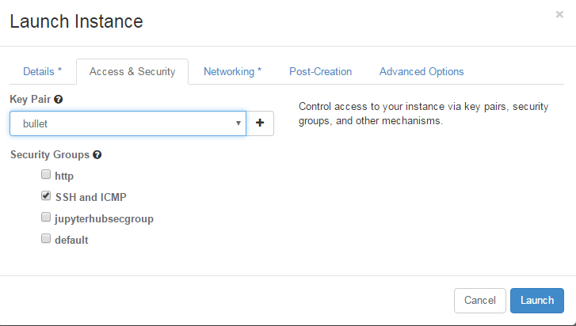

# Set-up an openstack server for Geosciences

Our goal is to set-up an openstack server where most software and libraries available on sverdrup can be used in a similar way.

 
### 1. [Login](https://iaas.readthedocs.io/en/latest/enduser/login.html#subsequent-logins) to the UIO dashboard [https://dashboard.iaas.uio.no/](https://dashboard.iaas.uio.no/)

### 2. Create a [Virtual machine](https://iaas.readthedocs.io/en/latest/enduser/create-virtual-machine.html#create-a-virtual-machine) using the following resources: 

Don't forget to tick "SSH and ICMP" in the Access & Security tab and to choose your SSH keypair (especially if you imported more than one!):
 

### 3. Login to your new openstack server. 

The IP address of your instance can be found in your "instances" section:

In our example the IP address is 158.37.63.184 and we assume your SSH private key is in your $HOME/.ssh and is call id_rsa

**From a Linux** (and probably Mac, even though I did not test it) machine:

To access your new created instance (and you are the only one to be able to login thanks to the usage of your SSH keypair), you do not use your UIO username but the generic ubuntu username

ssh -Y -i $HOME/.ssh/id_rsa ubuntu@158.37.63.184

**From a Windows machine**:

TO BE DONE

### 4. Install all the necessary software and libraries

sudo apt-get update

sudo apt-get install gcc

sudo apt-get install gfortran

sudo apt-get install g++

sudo apt-get install cmake

sudo apt-get install valgrind

sudo apt-get install environment-modules

sudo apt-get install freeglut3-dev

sudo apt-get install emacs24

sudo apt-get install m4

sudo apt-get install bison

sudo apt-get install mercurial

sudo apt-get install subversion

sudo apt-get install swig

sudo apt-get install flex

sudo apt-get install zlibc

sudo apt-get install zlib1g-dev 

sudo apt-get install libjpeg-dev

sudo apt-get install proj-bin

sudo apt-get install libproj-dev

sudo apt-get install udunits-bin

sudo apt-get install gdal-bin

sudo apt-get install libgdal-dev

sudo apt-get install libboost-dev

sudo apt-get install libjasper-dev

sudo apt-get install libpng-dev

sudo apt-get install libpython-dev

sudo apt-get install python-dev

sudo apt-get install python-pip

sudo apt-get install libfftw3-dev

sudo apt-get install libgdbm-dev

sudo apt-get install libxmu-dev

sudo apt-get install mesa-utils

sudo apt-get install exiv2

sudo apt-get install gedit

sudo apt-get install pandoc

sudo apt-get install qgis

sudo apt-get install cdo

sudo apt-get install ferret

sudo apt-get install grads

sudo apt-get install ncl-ncarg

sudo apt-get install nco

sudo apt-get install ncview

sudo apt-get install paraview

sudo apt-get install texmaker

sudo apt-get install xpra

sudo apt-get install netcdf-bin

sudo apt-get install libblas-dev liblapack-dev

sudo apt-get install libopenmpi-dev

sudo apt-get install openmpi-common

sudo apt-get install openmpi-bin

sudo apt-get install default-jre

sudo apt-get install default-jdk

sudo apt-get install qtbase5-dev

sudo apt-get install libqt5webkit5-dev

### 5. Set-up modulefiles path:

updated /usr/share/modules/init/.modulespath

And it should look like to [this file](.modulepath).

### 6. Manually installed software and libraries:

Additional libraries (available as a tarbal on norstore /projects/NS1000K/TARIUO/modules_iaas_ubuntu15.10Wily.tar

If you scp this file (according you have access to norStore and to NS1000K; contact GEO IT otherwise), you can just untar this file in the HOME area of your new openstack server.

Here we explain how to (re-)install these packages:

export PREFIX=/home/ubuntu/uio/modules/packages/

Installation de hdf5: (with openmpi)
=======================================

wget http://www.hdfgroup.org/ftp/lib-external/szip/2.1/src/szip-2.1.tar.gz

./configure --prefix=/home/ubuntu/uio/modules/packages/szip/2.1

wget http://www.hdfgroup.org/ftp/HDF5/current/src/hdf5-1.8.17.tar.gz

Can't have CXX enabled with parallel...

./configure  --with-szlib=$SZIP_HOME  --enable-fortran --enable-fortran2003  --prefix=/home/ubuntu/uio/modules/packages/hdf5/1.8.17 --enable-parallel

(test parallel hdf5 failed with parallel part (flush)). I did make install anyway!

Installation de netcdf: 
=======================================

C core interface:
------------------

wget ftp://ftp.unidata.ucar.edu/pub/netcdf/netcdf-4.4.1.tar.gz

CPPFLAGS="-I$HDF5_HOME/include -I/usr/include/mpi" LDFLAGS=-L$HDF5_HOME/lib ./configure --prefix=$PREFIX/netcdf/4.4.1  --enable-netcdf4

Fortran interface:
------------------

wget ftp://ftp.unidata.ucar.edu/pub/netcdf/netcdf-fortran-4.4.4.tar.gz

tar zxf netcdf-fortran-4.4.4.tar.gz

cd netcdf-fortran-4.4.4

module load netcdf

CPPFLAGS=-I$NETCDF_HOME/include LDFLAGS=-L$NETCDF_HOME/lib ./configure --prefix=$NETCDF_HOME
make
make check
make install

C++ 3 interface:
-----------------

wget ftp://ftp.unidata.ucar.edu/pub/netcdf/netcdf-cxx-4.2.tar.gz

tar zxf netcdf-cxx-4.2.tar.gz

cd netcdf-cxx-4.2

CPPFLAGS=-I$NETCDF_HOME/include LDFLAGS=-L$NETCDF_HOME/lib ./configure --prefix=$NETCDF_HOME

make

make check

make install

make clean

Installation of hdf4:
======================

wget http://www.hdfgroup.org/ftp/HDF/releases/HDF4.2.12/src/hdf-4.2.12.tar.gz

tar zxf hdf-4.2.12.tar.gz

cd hdf-4.2.12

./configure --prefix=/home/ubuntu/uio/modules/packages/hdf4/4.2.12

make

make check

make install

make clean

Installation of hdfeos:
========================

wget ftp://edhs1.gsfc.nasa.gov/edhs/hdfeos/latest_release/HDF-EOS2.19v1.00.tar.Z

uncompress HDF-EOS2.19v1.00.tar.Z

tar xf HDF-EOS2.19v1.00.tar

cd hdfeos

module load hdf4

CPPFLAGS=-I$HDF4_HOME/include LDFLAGS=-L$HDF4_HOME/lib ./configure --prefix=/home/ubuntu/uio/modules/packages/hdfeos/2.19

Installation of petsc:
=======================

wget http://ftp.mcs.anl.gov/pub/petsc/release-snapshots/petsc-3.7.2.tar.gz

tar zxf petsc-3.7.2.tar.gz

cd petsc-3.7.2

./configure --prefix=/home/ubuntu/uio/modules/packages/petsc/3.7.2 --with-cc=mpicc --with-cxx=mpic++ --with-fc=mpif90 --with-hdf5-dir=$HDF5_HOME

make PETSC_DIR=/home/ubuntu/uio/modules/src/petsc-3.7.2 PETSC_ARCH=arch-linux2-c-debug all

make PETSC_DIR=/home/ubuntu/uio/modules/src/petsc-3.7.2 PETSC_ARCH=arch-linux2-c-debug install

make PETSC_DIR=/home/ubuntu/uio/modules/packages/petsc/3.7.2 PETSC_ARCH="" test

make PETSC_DIR=/home/ubuntu/uio/modules/packages/petsc/3.7.2 PETSC_ARCH= streams

Installation of python 2:
=========================

wget http://repo.continuum.io/archive/Anaconda2-4.1.0-Linux-x86_64.sh

bash Anaconda2-4.1.0-Linux-x86_64.sh 

with installation in /home/ubuntu/uio/modules/packages/anaconda2/4.1.0

Installation of grib-api:
==========================

wget https://software.ecmwf.int/wiki/download/attachments/3473437/grib_api-1.16.0-Source.tar.gz 

tar zxf grib_api-1.16.0-Source.tar.gz 

cd grib_api-1.16.0-Source

module load netcdf

mkdir grib_api_build

cd grib_api_build

cmake  ../grib_api-1.16.0-Source -DCMAKE_INSTALL_PREFIX=/home/ubuntu/uio/modules/packages/grib_api/1.16.0

make 

make check

make install

Installation of emos:
======================

wget https://software.ecmwf.int/wiki/download/attachments/3473472/libemos-4.4.2-Source.tar.gz 

tar zxf libemos-4.4.2-Source.tar.gz 

mkdir emos_build

cd emos_build

module load grib_api/1.16.0

cmake ../libemos-4.4.2-Source -DCMAKE_INSTALL_PREFIX=/home/ubuntu/uio/modules/packages/emos/4.4.2

make

Installation of R:
==================

sudo apt-get remove r-base-core

sudo sh -c 'echo "deb http://cran.rstudio.com/bin/linux/ubuntu trusty/" >> /etc/apt/sources.list'

gpg --keyserver keyserver.ubuntu.com --recv-key E084DAB9

gpg -a --export E084DAB9 | sudo apt-key add -

sudo apt-get update

sudo apt-get -y install r-base

Installation de Rstudio:
========================

wget http://download1.rstudio.org/rstudio-0.99.902-amd64.deb

sudo dpkg -i *.deb

rm *.deb

Installation de Metview (bundle):
=================================

cmake ../MetviewBundle-2016.06.0-Source -DCMAKE_INSTALL_PREFIX=/home/ubuntu/uio/modules/packages/metview/2016.06.0 -DNETCDF4_PATH=$NETCDF_HOME   -DNETCDF_PATH=$NETCDF_HOME

make

make install

Installation de Vapor3D:
=================================

https://www.vapor.ucar.edu/internal/downloads/binary-distributions

Download Linux - x86_64 (64 bit)

./vapor-install.csh /home/ubuntu/uio/modules/packages/vapor/2.5.0

Installation de Panoply:
=================================

http://www.giss.nasa.gov/tools/panoply/download.html

Installation de mjograph:
=================================

https://sourceforge.net/projects/mjograph/files/latest/download?source=files
