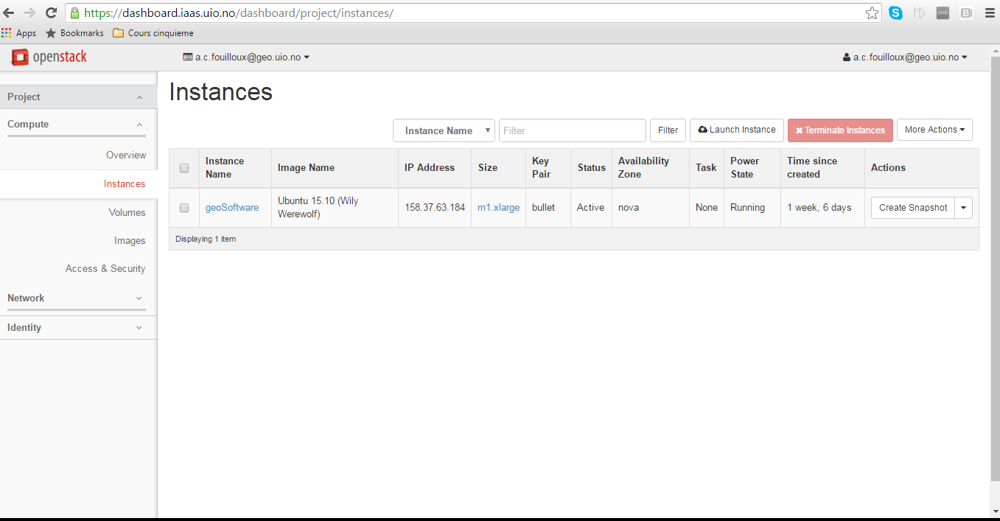

# Set-up an openstack server for Geosciences

Our goal is to set-up an openstack server where most software and libraries available on sverdrup can be used in a similar way.

 
### 1. [Login](https://iaas.readthedocs.io/en/latest/enduser/login.html#subsequent-logins) to the UIO dashboard [https://dashboard.iaas.uio.no/](https://dashboard.iaas.uio.no/)

### 2. Create a [Virtual machine](https://iaas.readthedocs.io/en/latest/enduser/create-virtual-machine.html#create-a-virtual-machine) using the following resources: 

Don't forget to tick "SSH and ICMP" in the Access & Security tab and to choose your SSH keypair (especially if you imported more than one!):
 

### 3. Login to your new openstack server. 

The IP address of your instance can be found in your "instances" section:

In our example the IP address is 158.37.63.184 and we assume your SSH private key is in your $HOME/.ssh and is call id_rsa

**From a Linux** (and probably Mac, even though I did not test it) machine:

To access your new created instance (and you are the only one to be able to login thanks to the usage of your SSH keypair), you do not use your UIO username but the generic ubuntu username

    ssh -Y -i $HOME/.ssh/id_rsa ubuntu@158.37.63.184

**From a Windows machine**:

TO BE DONE

### 4. Install all the necessary software and libraries
    
    sudo apt-get -y update
    sudo apt-get -y install  gcc
    sudo apt-get -y install  gfortran
    sudo apt-get -y install  g++
    sudo apt-get -y install  cmake
    sudo apt-get -y install  valgrind
    sudo apt-get -y install  environment-modules
    sudo apt-get -y install  freeglut3-dev
    sudo apt-get -y install  emacs24
    sudo apt-get -y install  m4
    sudo apt-get -y install  bison
    sudo apt-get -y install  mercurial
    sudo apt-get -y install  subversion
    sudo apt-get -y install  swig
    sudo apt-get -y install  flex
    sudo apt-get -y install  zlibc
    sudo apt-get -y install  zlib1g-dev 
    sudo apt-get -y install  libjpeg-dev
    sudo apt-get -y install  proj-bin
    sudo apt-get -y install  libproj-dev
    sudo apt-get -y install  udunits-bin
    sudo apt-get -y install  gdal-bin
    sudo apt-get -y install  libgdal-dev
    sudo apt-get -y install  libboost-dev
    sudo apt-get -y install  libjasper-dev
    sudo apt-get -y install  libpng-dev
    sudo apt-get -y install  libpython-dev
    sudo apt-get -y install  python-dev
    sudo apt-get -y install  python-pip
    sudo apt-get -y install  libfftw3-dev
    sudo apt-get -y install  libgdbm-dev
    sudo apt-get -y install  libxmu-dev
    sudo apt-get -y install  mesa-utils
    sudo apt-get -y install  exiv2
    sudo apt-get -y install  gedit
    sudo apt-get -y install  pandoc
    sudo apt-get -y install  qgis
    sudo apt-get -y install  cdo
    sudo apt-get -y install  ferret
    sudo apt-get -y install  grads
    sudo apt-get -y install  ncl-ncarg
    sudo apt-get -y install  nco
    sudo apt-get -y install  ncview
    sudo apt-get -y install  paraview
    sudo apt-get -y install  texmaker
    sudo apt-get -y install  xpra
    sudo apt-get -y install  libcairo2-dev
    sudo apt-get -y install  libpango1.0-dev 
    sudo apt-get -y install  libblas-dev liblapack-dev
    sudo apt-get -y install  libopenmpi-dev
    sudo apt-get -y install  openmpi-common
    sudo apt-get -y install  openmpi-bin
    sudo apt-get -y install  default-jre
    sudo apt-get -y install  default-jdk
    sudo apt-get -y install  qtbase5-dev
    sudo apt-get -y install  libqt5webkit5-dev
    
### 5. Set-up modulefiles path:

You would need to update /usr/share/modules/init/.modulespath (with any of your favourite and available editor...)

And it should look like to [this file](.modulespath).

### 6. Create a new volume

This step needs to be done once only i.e. you create a new volume to host your software once only and then you just [attach](https://iaas.readthedocs.io/en/latest/enduser/manage-volumes.html#attach-a-volume-to-a-virtual-machine)/[detach](https://iaas.readthedocs.io/en/latest/enduser/manage-volumes.html#detach-a-volume-from-a-virtual-machine) it from your running instances.

To create a new volume to host all your "manually" installed software as well as local data (please make backup of your data and use this volume as a local storage (for processing your data), follow instructions given at [https://iaas.readthedocs.io/en/latest/enduser/manage-volumes.html](https://iaas.readthedocs.io/en/latest/enduser/manage-volumes.html) to [create a new volume](https://iaas.readthedocs.io/en/latest/enduser/manage-volumes.html#create-a-volume) and [attach it to your instance](https://iaas.readthedocs.io/en/latest/enduser/manage-volumes.html#attach-a-volume-to-a-virtual-machine).

Once created (**to be done with a new volume only**):

### Find out which device to mount: ###

    lsblk

This command will return something like:

    NAME   MAJ:MIN RM  SIZE RO TYPE MOUNTPOINT
    vda 253:0   0  20G  0 disk
    |__vda1 253:1   0  20G  0 part /
    vdb 253:16  0  20G  0 disk

The last line is the most important. Here it tells you that vdb is your new volume. (if you have vdc or any other "name", please make sure you adapt the next commands!).

### Create an ext4 File System: ###

    mkfs.ext4 /dev/vdb

### Create a new directory to mount your new volume: ###

    mkdir -p /opt/uio
    

### Mount your new volume: ###

     mount /dev/vdb /opt/uio

### Check your new volume: ###

    df -h /opt/uio

It should return something like:
    
    FilesystemSize  Used Available Use% Mounted on
    /dev/vdb  19.8G150.5M  19.2G   2% /opt/uio

### 7. Manually installed software and libraries:

Additional libraries (available as a tarbal on norstore /projects/NS1000K/TARIUO/geoSoftware_iaas_ubuntu15.10Wily.tar

If you scp this file (according you have access to norStore and to NS1000K; contact GEO IT otherwise), you can just untar this file in your newly created volume (/opt/uio) area attached to your openstack server.

Here we explain how to (re-)install these packages:

    # prefix where we will install all our packages
    export PREFIX=/opt/uio/modules/packages/
    # directory where we compile (can be removed after installation)
    mkdir /opt/uio/modules/src
    cd /opt/uio/modules/src

Installation de hdf5: (with openmpi)
=======================================

    wget http://www.hdfgroup.org/ftp/lib-external/szip/2.1/src/szip-2.1.tar.gz
    
    ./configure --prefix=$PREFIX/szip/2.1
    
    wget http://www.hdfgroup.org/ftp/HDF5/current/src/hdf5-1.8.17.tar.gz
    
    Can't have CXX enabled with parallel...
    
    ./configure  --with-szlib=$SZIP_HOME  --enable-fortran --enable-fortran2003  --prefix=$PREFIX/hdf5/1.8.17 --enable-parallel

**Note**: test parallel hdf5 failed with parallel part (flush). I did make install anyway! Please contact geo-it if you have problems with hdf5.

Installation de netcdf: 
=======================================

C core interface:
------------------

    wget ftp://ftp.unidata.ucar.edu/pub/netcdf/netcdf-4.4.1.tar.gz
    
    CPPFLAGS="-I$HDF5_HOME/include -I/usr/include/mpi" LDFLAGS=-L$HDF5_HOME/lib ./configure --prefix=$PREFIX/netcdf/4.4.1  --enable-netcdf4

Fortran interface:
------------------

    wget ftp://ftp.unidata.ucar.edu/pub/netcdf/netcdf-fortran-4.4.4.tar.gz
    
    tar zxf netcdf-fortran-4.4.4.tar.gz
    
    cd netcdf-fortran-4.4.4
    
    module load netcdf
    
    CPPFLAGS=-I$NETCDF_HOME/include LDFLAGS=-L$NETCDF_HOME/lib ./configure --prefix=$NETCDF_HOME
    make
    make check
    make install

C++ 3 interface:
-----------------

    wget ftp://ftp.unidata.ucar.edu/pub/netcdf/netcdf-cxx-4.2.tar.gz
    
    tar zxf netcdf-cxx-4.2.tar.gz
    
    cd netcdf-cxx-4.2
    
    CPPFLAGS=-I$NETCDF_HOME/include LDFLAGS=-L$NETCDF_HOME/lib ./configure --prefix=$NETCDF_HOME
    
    make   
    make check    
    make install    
    make clean

Installation of hdf4:
======================

    wget http://www.hdfgroup.org/ftp/HDF/releases/HDF4.2.12/src/hdf-4.2.12.tar.gz
    
    tar zxf hdf-4.2.12.tar.gz
    
    cd hdf-4.2.12
    
    ./configure --prefix=$PREFIX/hdf4/4.2.12
    
    make
    make check
    make install
    make clean

Installation of hdfeos:
========================

    wget ftp://edhs1.gsfc.nasa.gov/edhs/hdfeos/latest_release/HDF-EOS2.19v1.00.tar.Z
    
    uncompress HDF-EOS2.19v1.00.tar.Z
    
    tar xf HDF-EOS2.19v1.00.tar
    
    cd hdfeos
    
    module load hdf4
    
    CPPFLAGS=-I$HDF4_HOME/include LDFLAGS=-L$HDF4_HOME/lib ./configure --prefix=$PREFIX/hdfeos/2.19
    
    make
    make install

Installation of petsc:
=======================

w    get http://ftp.mcs.anl.gov/pub/petsc/release-snapshots/petsc-3.7.2.tar.gz
    
    tar zxf petsc-3.7.2.tar.gz
    
    cd petsc-3.7.2
    
    ./configure --prefix=$PREFIX/petsc/3.7.2 --with-cc=mpicc --with-cxx=mpic++ --with-fc=mpif90 --with-hdf5-dir=$HDF5_HOME
    
    make PETSC_DIR=/opt/uio/modules/src/petsc-3.7.2 PETSC_ARCH=arch-linux2-c-debug all
    
    make PETSC_DIR=/opt/uio/modules/src/petsc-3.7.2 PETSC_ARCH=arch-linux2-c-debug install
    
    make PETSC_DIR=$PREFIX/petsc/3.7.2 PETSC_ARCH="" test
    
    make PETSC_DIR=$PREFIX/petsc/3.7.2 PETSC_ARCH= streams

Installation of python 2:
=========================

    wget http://repo.continuum.io/archive/Anaconda2-4.1.0-Linux-x86_64.sh
    
    bash Anaconda2-4.1.0-Linux-x86_64.sh 

with installation in /opt/uio/modules/packages/anaconda2/4.1.0

Installation of grib-api:
==========================

    wget https://software.ecmwf.int/wiki/download/attachments/3473437/grib_api-1.16.0-Source.tar.gz 
    
    tar zxf grib_api-1.16.0-Source.tar.gz 
    
    cd grib_api-1.16.0-Source
    
    module load netcdf
    
    mkdir grib_api_build
    
    cd grib_api_build
    
    cmake  ../grib_api-1.16.0-Source -DCMAKE_INSTALL_PREFIX=$PREFIX/grib_api/1.16.0
    
    make 
    make check
    make install

Installation of emos:
======================

    wget https://software.ecmwf.int/wiki/download/attachments/3473472/libemos-4.4.2-Source.tar.gz 
    
    tar zxf libemos-4.4.2-Source.tar.gz 
    
    mkdir emos_build
    
    cd emos_build
    
    module load grib_api/1.16.0
    
    cmake ../libemos-4.4.2-Source -DCMAKE_INSTALL_PREFIX=$PREFIX/emos/4.4.2
    
    make

Installation of R:
==================

    sudo apt-get remove r-base-core
    
    sudo sh -c 'echo "deb http://cran.rstudio.com/bin/linux/ubuntu trusty/" >> /etc/apt/sources.list'
    
    gpg --keyserver keyserver.ubuntu.com --recv-key E084DAB9
    
    gpg -a --export E084DAB9 | sudo apt-key add -
    
    sudo apt-get update
    
    sudo apt-get -y install r-base

Installation de Rstudio:
========================

    wget http://download1.rstudio.org/rstudio-0.99.902-amd64.deb
    
    sudo dpkg -i *.deb
    
    rm *.deb

Installation de Metview (bundle):
=================================

    sudo apt-get -y update
    cmake ../MetviewBundle-2016.06.0-Source -DCMAKE_INSTALL_PREFIX=$PREFIX/metview/2016.06.0 -DNETCDF4_PATH=$NETCDF_HOME   -DNETCDF_PATH=$NETCDF_HOME
    
    make
    make install

Installation de Vapor3D:
=================================

Download Linux - x86_64 (64 bits) binary distribution at [https://www.vapor.ucar.edu/internal/downloads/binary-distributions](https://www.vapor.ucar.edu/internal/downloads/binary-distributions)

./vapor-install.csh $PREFIX/vapor/2.5.0

Installation de Panoply:
=================================

[http://www.giss.nasa.gov/tools/panoply/download.html](http://www.giss.nasa.gov/tools/panoply/download.html)

Installation de mjograph:
=================================

[https://sourceforge.net/projects/mjograph/files/latest/download?source=files](https://sourceforge.net/projects/mjograph/files/latest/download?source=files)
