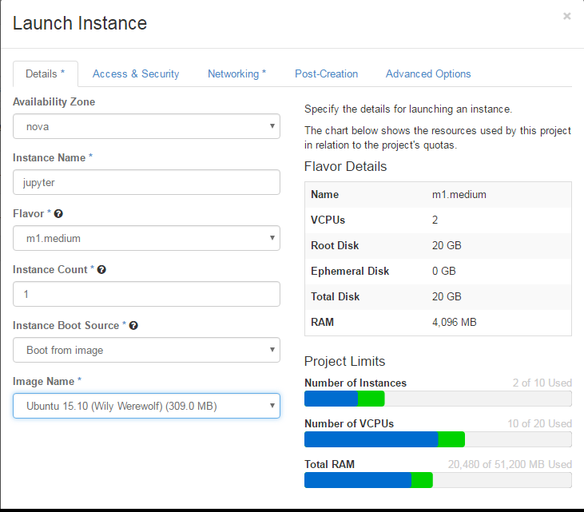
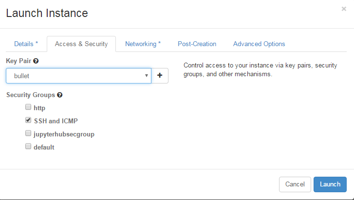
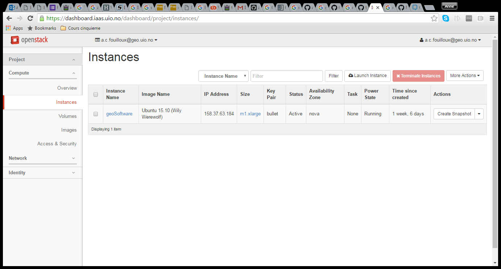

# Set-up a jupyter notebook 

Our goal is to set-up an openstack server and use it for running ipython/jupyter notebook.

 
### 1. [Login](https://iaas.readthedocs.io/en/latest/enduser/login.html#subsequent-logins) to the UIO dashboard [https://dashboard.iaas.uio.no/](https://dashboard.iaas.uio.no/)

### 2. Create a [Virtual machine](https://iaas.readthedocs.io/en/latest/enduser/create-virtual-machine.html#create-a-virtual-machine) using the following resources: 

Don't forget to tick "SSH and ICMP" in the Access & Security tab and to choose your SSH keypair (especially if you imported more than one!):
 

### 3. Login to your new openstack server. 

The IP address of your instance can be found in your "instances" section:

In our example the IP address is 158.37.63.220 and we assume your SSH private key is in your $HOME/.ssh and is call id_rsa

**From a Linux** (and probably Mac, even though I did not test it) machine:

To access your new created instance (and you are the only one to be able to login thanks to the usage of your SSH keypair), you do not use your UIO username but the generic ubuntu username

    ssh -Y -i $HOME/.ssh/id_rsa ubuntu@158.37.63.220

**From a Windows machine**:

TO BE DONE

### 4. Install all the necessary software and libraries

    sudo apt-get install x11-apps
    sudo apt-get update
    sudo apt-get install openjdk-9-jre
    sudo apt-get install firefox

Installation of python 3
==========================

    wget http://repo.continuum.io/archive/Anaconda3-4.1.0-Linux-x86_64.sh
    
    bash Anaconda3-4.1.0-Linux-x86_64.sh
    

- When asked where to install python, I chose the default location

- At the end of the installation, I accepted to add the PATH for python3 anaconda in .bashrc

**Note**: Anaconda 4.1.0 may not be the latest version available. We suggest you try install the latest version of Anaconda; check [https://www.continuum.io/ ](https://www.continuum.io/ )downloads

Additional python packages
===========================

We oftenv need additional python packages (such as ncdf4, etc.). The first thing to do is updating conda: 

    conda update conda
    
    conda install --channel https://conda.anaconda.org/anaconda-nb-extensions nbbrowserpdf

We give here a non exhaustive list of what we have installed:

- netCDF4:
  

    conda install netcdf4

- basemap:

    conda install -c anaconda basemap

- iris

    conda install --channel https://conda.anaconda.org/IOOS iris

### 5. Start your jupyter notebook

    jupyter notebook

This previous command opens a new browser with jupyter notebook. You are now ready to work!

Remember, you can logout and login again on the same instance. You do not need to re-install python and all the packages and can just start python notebook.

**Note**: you can install python 2 instead of python 3 (make sure you download Anaconda2-4.1.0-Linux-x86_64.sh)

